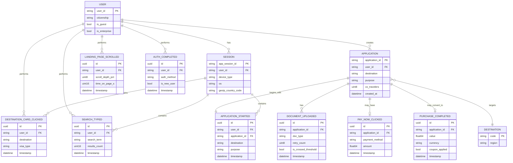
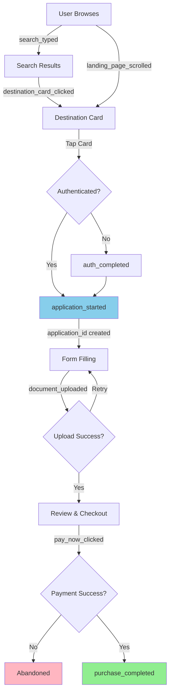
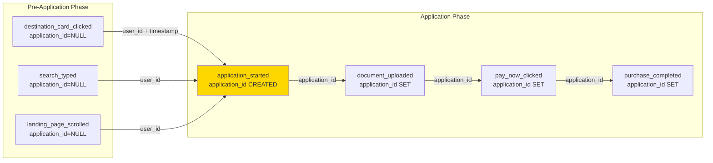
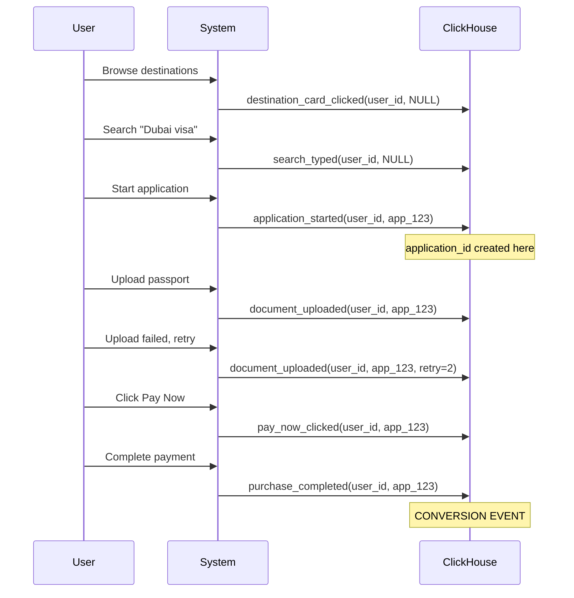
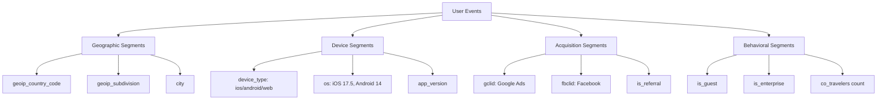

# Entity Relationship Diagram

## Visual Model

```mermaid
erDiagram
    USER ||--o{ SESSION : "has"
    USER ||--o{ APPLICATION : "creates"
    USER ||--o{ DESTINATION_CARD_CLICKED : "performs"
    USER ||--o{ SEARCH_TYPED : "performs"
    USER ||--o{ LANDING_PAGE_SCROLLED : "performs"
    USER ||--o{ AUTH_COMPLETED : "performs"
    
    APPLICATION ||--|| APPLICATION_STARTED : "begins_with"
    APPLICATION ||--o{ DOCUMENT_UPLOADED : "has"
    APPLICATION ||--o| PAY_NOW_CLICKED : "may_have"
    APPLICATION ||--o| PURCHASE_COMPLETED : "may_convert_to"
    APPLICATION }o--|| DESTINATION : "targets"
    
    SESSION ||--o{ DESTINATION_CARD_CLICKED : "contains"
    SESSION ||--o{ SEARCH_TYPED : "contains"
    SESSION ||--o{ APPLICATION_STARTED : "contains"
    
    USER {
        string user_id PK
        string citizenship
        bool is_guest
        bool is_enterprise
    }
    
    APPLICATION {
        string application_id PK
        string user_id FK
        string destination
        string purpose
        uint8 co_travelers
        datetime created_at
    }
    
    SESSION {
        string app_session_id PK
        string user_id FK
        string device_type
        string os
        string geoip_country_code
    }
    
    DESTINATION_CARD_CLICKED {
        uuid id PK
        string user_id FK
        string destination
        string visa_type
        datetime timestamp
    }
    
    APPLICATION_STARTED {
        uuid id PK
        string user_id FK
        string application_id FK
        string destination
        string purpose
        datetime timestamp
    }
    
    DOCUMENT_UPLOADED {
        uuid id PK
        string application_id FK
        string doc_type
        uint8 retry_count
        bool is_crossed_threshold
        datetime timestamp
    }
    
    PAY_NOW_CLICKED {
        uuid id PK
        string application_id FK
        string payment_method
        float64 amount
        datetime timestamp
    }
    
    PURCHASE_COMPLETED {
        uuid id PK
        string application_id FK
        float64 value
        string currency
        bool coupon_applied
        datetime timestamp
    }
    
    SEARCH_TYPED {
        uuid id PK
        string user_id FK
        string search_term
        uint16 results_count
        datetime timestamp
    }
    
    LANDING_PAGE_SCROLLED {
        uuid id PK
        string user_id FK
        uint8 scroll_depth_pct
        uint16 time_on_page_s
        datetime timestamp
    }
    
    AUTH_COMPLETED {
        uuid id PK
        string user_id FK
        string auth_method
        bool is_new_user
        datetime timestamp
    }
    
    DESTINATION {
        string code PK
        string region
    }
```

## Funnel Flow Diagram

```mermaid
graph TD
    A[User Browses] -->|search_typed| B[Search Results]
    B -->|destination_card_clicked| C[Destination Card]
    A -->|landing_page_scrolled| C
    
    C -->|Tap Card| D{Authenticated?}
    D -->|No| E[auth_completed]
    D -->|Yes| F[application_started]
    E --> F
    
    F -->|application_id created| G[Form Filling]
    G -->|document_uploaded| H{Upload Success?}
    H -->|Retry| G
    H -->|Yes| I[Review & Checkout]
    
    I -->|pay_now_clicked| J{Payment Success?}
    J -->|No| K[Abandoned]
    J -->|Yes| L[purchase_completed]
    
    style L fill:#90EE90
    style K fill:#FFB6C1
    style F fill:#87CEEB
```

## Data Flow by Join Keys

```mermaid
graph LR
    subgraph "Pre-Application Phase"
        A[destination_card_clicked<br/>application_id=NULL]
        B[search_typed<br/>application_id=NULL]
        C[landing_page_scrolled<br/>application_id=NULL]
    end
    
    subgraph "Application Phase"
        D[application_started<br/>application_id CREATED]
        E[document_uploaded<br/>application_id SET]
        F[pay_now_clicked<br/>application_id SET]
        G[purchase_completed<br/>application_id SET]
    end
    
    A -->|user_id + timestamp| D
    B -->|user_id| D
    C -->|user_id| D
    D -->|application_id| E
    E -->|application_id| F
    F -->|application_id| G
    
    style D fill:#FFD700
```

## Temporal Sequence Pattern

```mermaid
sequenceDiagram
    participant U as User
    participant S as System
    participant DB as ClickHouse
    
    U->>S: Browse destinations
    S->>DB: destination_card_clicked(user_id, NULL)
    
    U->>S: Search "Dubai visa"
    S->>DB: search_typed(user_id, NULL)
    
    U->>S: Start application
    S->>DB: application_started(user_id, app_123)
    Note over DB: application_id created here
    
    U->>S: Upload passport
    S->>DB: document_uploaded(user_id, app_123)
    
    U->>S: Upload failed, retry
    S->>DB: document_uploaded(user_id, app_123, retry=2)
    
    U->>S: Click Pay Now
    S->>DB: pay_now_clicked(user_id, app_123)
    
    U->>S: Complete payment
    S->>DB: purchase_completed(user_id, app_123)
    Note over DB: CONVERSION EVENT
```

## Segment Dimensions

```mermaid
graph TD
    USER[User Events] --> GEO[Geographic Segments]
    USER --> DEV[Device Segments]
    USER --> ACQ[Acquisition Segments]
    USER --> BEH[Behavioral Segments]
    
    GEO --> GEO1[geoip_country_code]
    GEO --> GEO2[geoip_subdivision]
    GEO --> GEO3[city]
    
    DEV --> DEV1[device_type: ios/android/web]
    DEV --> DEV2[os: iOS 17.5, Android 14]
    DEV --> DEV3[app_version]
    
    ACQ --> ACQ1[gclid: Google Ads]
    ACQ --> ACQ2[fbclid: Facebook]
    ACQ --> ACQ3[is_referral]
    
    BEH --> BEH1[is_guest]
    BEH --> BEH2[is_enterprise]
    BEH --> BEH3[co_travelers count]
```
