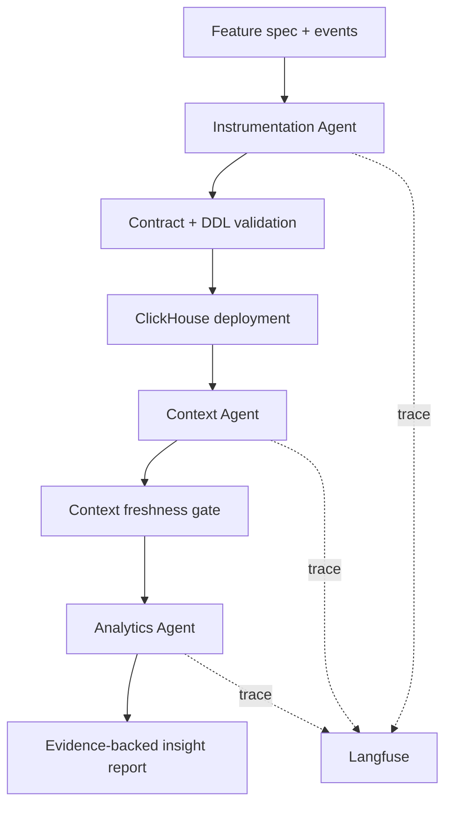

# 2. Architecture

## Overview

Context Compiler is a compiler-style analytics pipeline. It takes a product feature brief and event sample, derives a contract and schema, deploys the table into ClickHouse, updates the business context, and produces an evidence-backed insight report.

## Agent handoff

1. The Instrumentation Agent inspects the spec and raw sample, proposes an analytics contract, and produces a ClickHouse schema plan.
2. The schema and table are validated and deployed into ClickHouse.
3. The Context Agent reads the new schema and updates the approved context layer, including contradictions, relationships, and a changelog.
4. The Analytics Agent runs SQL against the deployed tables, uses the latest approved context, and writes product-facing insights with query evidence.

## Where the context layer is stored

The context layer is stored in ClickHouse metadata tables rather than as a flat file. The core tables are:

- [../context-compiler/migrations/075_context_changelog.sql](../context-compiler/migrations/075_context_changelog.sql)
- [../context-compiler/migrations/040_context_versions.sql](../context-compiler/migrations/040_context_versions.sql)
- [../context-compiler/migrations/050_context_issues.sql](../context-compiler/migrations/050_context_issues.sql)

This choice is intentional because judges and agents can query the latest approved version transactionally, inspect the full changelog, and compare versions over time.

## Langfuse wiring

Langfuse is wired through [../context-compiler/app/core/tracing.py](../context-compiler/app/core/tracing.py) and is used by the API and agent pipeline to record:

- trace roots for each pipeline run;
- nested observations by agent and stage;
- LLM generation metadata and token usage when available;
- spans for validation, SQL execution, and insight generation.

## LLM provider

The backend is provider-neutral. It uses environment-driven configuration for an OpenAI-compatible LLM provider so the provider can be changed without code changes. The relevant configuration is documented in [../context-compiler/RUN.md](../context-compiler/RUN.md) and [../context-compiler/.env.example](../context-compiler/.env.example).

## Why this architecture fits the problem

The system is designed around evidence, versioning, and auditability rather than free-form prompting alone. ClickHouse computes the facts; deterministic validators protect the schema and context; the LLM explains the structure and the business implications.
