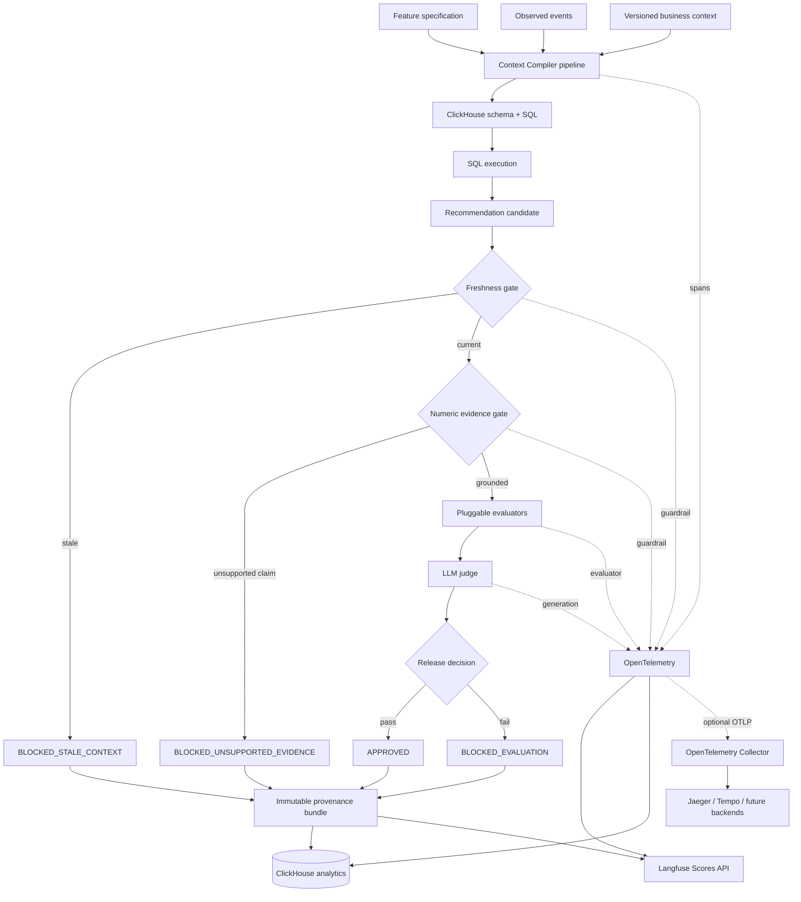

# AI Observability and Evaluation Architecture

## Outcome

Context Compiler now has an OpenTelemetry-first TypeScript subsystem that treats a recommendation as a governed artifact, not a string. A recommendation is only `APPROVED` after immutable context versions, SQL, evidence, and every required deterministic evaluator pass. Stale context returns `BLOCKED_STALE_CONTEXT`; any number absent from SQL output returns `BLOCKED_UNSUPPORTED_EVIDENCE`. Accepted and rejected decisions are both persisted with a trace ID and checksums so the decision can be replayed and audited.

The existing Python Langfuse instrumentation remains the request-level entry point. The TypeScript framework is the recommendation release boundary and uses the current Langfuse v5 OpenTelemetry-native SDK packages. It can be called in-process by a TypeScript worker or exposed as an internal service from the application composition root.

## Architecture



Langfuse receives semantic `chain`, `agent`, `tool`, `generation`, `guardrail`, and `evaluator` observations. ClickHouse receives both OTel span facts and normalized decision records. The optional collector configuration is in `deploy/otel-collector.yaml`; the SDK processors are the default because they preserve Langfuse's AI-specific semantics.

## Source layout

```text
src/
  agents/       recommendation boundary, LLM judge, production factory
  analytics/    reusable ClickHouse analysis queries
  clickhouse/   SDK adapter, OTel processor, provenance repository
  dashboard/    dashboard metric queries
  evaluators/   evaluator interface, engine, nine evaluators, evidence verifier
  langfuse/     idempotent score publisher
  prompts/      versioned judge prompt
  provenance/   immutable provenance builder and repository interface
  tracing/      backend-neutral interface and Langfuse/OpenTelemetry adapter
  types/        domain models and validated runtime configuration
  utils/        canonical hashing and structured logging
```

Each concrete adapter is constructor-injected. There is no application singleton. The production composition root is `createProductionFramework`; tests use in-memory tracing, scoring, and persistence adapters.

The deployable internal boundary is `POST /v1/recommendations/evaluate` on `127.0.0.1:4319`. Build and start it with `npm run build && npm run start:observability`. Set `OBSERVABILITY_AUTH_TOKEN` when the caller is not in the same trusted process namespace. The endpoint returns HTTP 200 only for `APPROVED`; governed blocking decisions use HTTP 422 and retain their full provenance payload. The request body is capped at 5 MiB and validated at runtime before tracing or persistence.

The existing FastAPI pipeline calls this endpoint when `CONTEXT_COMPILER_RECOMMENDATION_EVALUATOR_URL` is set. It sends the raw feature spec, latest approved context version, generated schema version/checksum, SQL rows, evidence checksums, prompt/model versions, and candidate. A block or unavailable boundary removes the candidate from the API response and prevents insight persistence. Production configuration rejects startup without the boundary URL. The sidecar itself requires LLM credentials so Recommendation Quality is never omitted in production.

## Trace contract

One `recommendation-lifecycle` root chain contains:

```text
recommendation-lifecycle
└── evaluations
    ├── evaluate.sql-validity             evaluator
    ├── evaluate.evidence-coverage        evaluator
    ├── evaluate.freshness                guardrail
    ├── evaluate.groundedness             guardrail
    ├── evaluate.spec-alignment           evaluator
    ├── evaluate.schema-consistency       evaluator
    ├── evaluate.hallucination-risk       evaluator
    ├── evaluate.recommendation-confidence evaluator
    └── evaluate.business-impact          evaluator
├── llm-judge                             generation
├── persist-provenance                    tool
└── publish-langfuse-scores               tool
```

The generation observation records model, prompt version, token usage, cost when supplied, latency, input, output, and errors. Every other observation records input, output, metadata, latency, and errors. A configurable mask runs in the Langfuse span processor before export; secrets and raw personally identifiable event data must not be placed in inputs.

## Evaluator contract

Every evaluator implements:

```ts
interface Evaluator {
  readonly name: EvaluationName;
  evaluate(context: EvaluationContext): Promise<EvaluationResult> | EvaluationResult;
}

interface EvaluationResult {
  name: EvaluationName;
  score: number;       // 0..1
  passed: boolean;
  reason: string;
  metadata: Record<string, JsonValue>;
}
```

The nine implementations are independently addressable through `EvaluationEngine.runOne`. `hallucination-risk` is the one inverse metric: zero is best and values over `0.2` fail. The other metrics are higher-is-better. Deterministic checks run before the LLM judge; the judge cannot override failed freshness, SQL, or evidence gates.

### Numerical evidence policy

`NumericEvidenceVerifier` extracts every integer, decimal, formatted number, and percentage from recommendation prose. It recursively scans cited SQL rows and records the evidence IDs supporting each claim. A percentage such as `42%` may match either `42` or the ratio `0.42`; tolerance is one part per million. No numeric claims is a valid score of `1`. Any unsupported claim makes groundedness fail and forces `BLOCKED_UNSUPPORTED_EVIDENCE`.

## Provenance model

Every decision stores recommendation ID, trace ID, status, spec/schema/context IDs and checksums, prompt name/version, provider/model/version, SQL, evidence IDs, evaluator results, optional judge result, timestamp, and canonical SHA-256 hashes of inputs and output. Hashes use recursively key-sorted JSON, making reproduction checks stable across process restarts.

Example:

```json
{
  "recommendationId": "rec-checkout-001",
  "traceId": "4fc9e3f5044544d38f4f60ed4f89d688",
  "status": "APPROVED",
  "versions": {
    "spec": {"id": "spec-v4", "checksum": "..."},
    "schema": {"id": "schema-v9", "checksum": "..."},
    "businessContext": {"id": "context-v7", "checksum": "..."}
  },
  "prompt": {"name": "product-recommendation", "version": "12"},
  "model": {"provider": "openai", "name": "gpt-5", "version": "2026-08-01"},
  "sql": "SELECT conversion_rate FROM product.checkout_daily ...",
  "evidenceIds": ["ev-checkout-001"],
  "evaluations": [{"name": "groundedness", "score": 1, "passed": true, "reason": "Every numerical claim is grounded in SQL output.", "metadata": {}}],
  "inputChecksum": "...",
  "outputChecksum": "...",
  "timestamp": "2026-08-02T00:00:00.000Z"
}
```

## Langfuse scores

`LangfuseScorePublisher` publishes trace-level numeric scores with deterministic IDs, so retrying the same recommendation and trace is idempotent:

- Groundedness
- Freshness
- Confidence
- Evidence Coverage
- Hallucination Risk
- Business Alignment
- Recommendation Quality (LLM judge)
- SQL Validity

Always flush at request/worker boundaries and call runtime `shutdown()` during graceful termination. Evaluator reasons are placed in score comments; model, prompt version, recommendation ID, and judge confidence are metadata.

Score publication happens before ClickHouse recommendation publication. Within ClickHouse, evaluator, judge, and provenance rows are inserted before the recommendation row, which acts as the publication marker. Failures may leave retry-safe orphan audit rows or Langfuse scores, but cannot leave a visible recommendation without its prior audit material.

## ClickHouse model and analytics

Migrations `090` through `095` create `ai_traces`, `ai_spans`, `ai_recommendations`, `ai_evaluations`, `ai_judge_results`, and `reasoning_provenance`. Run:

```bash
uv run python -m app.clickhouse.migrations
```

The queries in `src/analytics/queries.ts` cover average confidence by model, hallucination trend, prompt comparison, evaluator failures, latency, cost, top failing prompts, spec alignment, and freshness violations. `src/dashboard/queries.ts` defines the requested accuracy, confidence, evidence coverage, groundedness, latency, cost, token, failure, hallucination, freshness, and evaluator-heatmap panels. Replace `{database}` with the safe configured metadata database before execution.

## Application dashboard

The React application includes an **AI Observability** section at `#observability`. Its `/dashboard` adapter combines recent Langfuse traces/scores with the normalized ClickHouse recommendation tables. The UI displays trace volume, approval and failure rates, confidence, latency, tokens, cost, evaluator score bars, deep links to Langfuse traces, and model/prompt details for governed recommendations. It refreshes at application load, immediately after a journey, and again after five seconds to account for telemetry ingestion latency.

Langfuse credentials remain server-side. The browser only receives bounded aggregate values, trace metadata, and authenticated Langfuse UI links; it never receives the public or secret API keys.

## Production assembly

```ts
const runtime = createProductionFramework(config, { clickhouse, logger, judge });
try {
  const decision = await withTraceAttributes(config.serviceVersion, {
    sessionId: runId,
    tags: ["context-compiler", "recommendation"],
    metadata: { featureSlug },
  }, () => runtime.framework.evaluate(evaluationContext));
  if (decision.status !== "APPROVED") return decision.status;
  return decision.recommendation;
} finally {
  await runtime.shutdown(); // process shutdown, not after every request in a server
}
```

Construct `EvaluationContext.currentVersions` immediately before evaluation from the latest approved spec, schema, and business-context records. Do not trust version IDs supplied by a model or client. SQL rows must come from already-executed `query_evidence`, and evidence checksums must be verified before building the context.

## Verification

```bash
npm install
npm run typecheck
npm test
npm run build
npm run example
uv run pytest
```

For the opt-in live Langfuse connectivity test used by the Python application:

```bash
RUN_LANGFUSE_LIVE_TEST=1 uv run pytest -q tests/test_langfuse_integration.py::test_live_langfuse_connectivity
```

After a live trace, audit the Langfuse UI/API for a single root, correct parent-child nesting, semantic observation types, model and usage on generations, version metadata, all eight score names, and the absence of secrets or raw event records.
