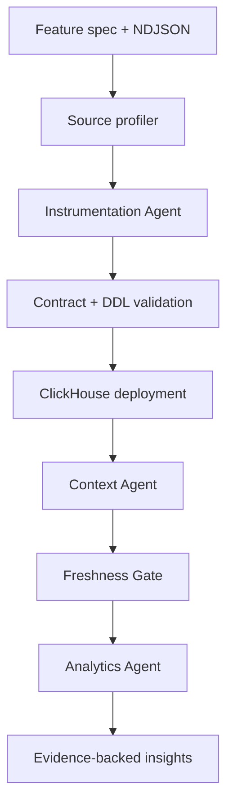
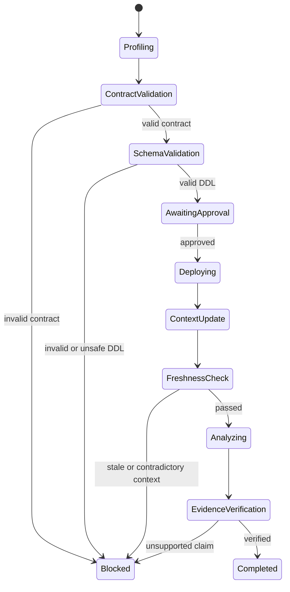

# Context Compiler

## Implementation and Design Specification

**Hackathon:** Click-a-thon 2026  
**Problem:** Atlys — From feature spec to insight  
**Document status:** Implementation baseline  
**Primary datastore and analytical engine:** ClickHouse  
**Agent observability:** Langfuse  

---

## 1. Executive summary

Context Compiler is an agentic analytics system that turns a product feature specification and raw event sample into four auditable outputs:

1. A versioned **analytics contract** describing events, entities, dimensions, metrics, funnels, and data-quality rules.
2. A validated, production-oriented **ClickHouse schema** with ingestion mappings and justified materialized views.
3. An updated **living context layer** containing business definitions, relationships, contradictions, and a changelog.
4. An evidence-backed **product insight report** in which every numerical claim points to a deterministic ClickHouse query.

The system is designed for the unseen sixth feature specification. No implementation step may depend on a hard-coded list of the five known features. Feature-specific behavior must be derived from the spec, raw-event profile, existing schemas, and latest context version.

The core product principle is:

> ClickHouse computes facts, deterministic validators protect correctness, and the LLM interprets structure and narrates evidence.

---

## 2. Goals and non-goals

### 2.1 Goals

- Accept an arbitrary Markdown feature spec plus NDJSON event sample.
- Infer event names, fields, types, nullability, identifiers, relationships, funnels, metrics, dimensions, and likely PM questions.
- Generate optimized ClickHouse DDL and validate it before execution.
- Load raw NDJSON without manually authored per-feature ingestion code.
- update context immediately after schema deployment.
- Prevent analytics from running against stale context.
- Perform all numerical analysis inside ClickHouse.
- Produce actionable product insights with confidence, limitations, and reproducible query evidence.
- Trace every agent decision, tool call, context version, SQL statement, validation result, and final artifact in Langfuse.
- Complete the unseen-spec workflow through one command or one UI action.

### 2.2 Non-goals

- Authentication and authorization.
- Production deployment or streaming infrastructure.
- A highly polished frontend.
- Sending raw datasets to an LLM.
- Autonomous execution of unvalidated or destructive SQL.
- General-purpose BI dashboarding.

---

## 3. Product positioning

Context Compiler is not three unrelated chat agents. It is a compiler-like pipeline with typed intermediate artifacts, validation gates, immutable versions, and traceable outputs.



Each stage consumes a stored artifact from the previous stage. A run can therefore be replayed, inspected, or stopped at a validation gate without losing its reasoning history.

---

## 4. Package findings that shape the design

The supplied package contains eight existing event tables, five feature specs, approximately 2.5 million existing rows, and roughly 29,000 feature-event samples. The known feature specs are Express Checkout, Group/Family Applications, Visa Status Sharing, Abandoned Checkout Recovery, and Instant Forex Add-on.

The base context intentionally conflicts with the actual schemas. The initial Context Agent must surface at least these issues:

| ID | Context claim | Observed reality | Severity |
|---|---|---|---|
| C-001 | `application_started` carries integer `visa_issuance_eta_days` | DDL contains `eta_shown Nullable(String)` | High |
| C-002 | Conversion rate means purchases divided by sessions | Funnel conversion is separately defined as purchase users divided by application-started users | High |
| C-003 | Every event contains `user_id` | Status-sharing recipient events are keyed by `share_id` | High |
| C-004 | Every destination belongs to a region | No region column or destination-region mapping is provided | Medium |
| C-005 | Revenue per conversion is directly aggregatable | `purchase_completed.value` is denominated in event-level currencies | High |
| C-006 | Funnel uses users reaching ordered stages | A user may have multiple applications, creating cross-journey attribution risk | High |
| C-007 | Existing tables are optimized raw streams | Legacy sort key begins with random `id`, while queries filter by time and segment | Medium |
| C-008 | Device and OS are stable dimensions | Values are inconsistent and Android may have null OS | Medium |

These contradictions are not silently corrected. They become versioned context issues with status `open`, `accepted`, `superseded`, or `resolved`.

---

## 5. System architecture

### 5.1 Components

| Component | Responsibility | Deterministic or LLM-assisted |
|---|---|---|
| Run Orchestrator | State machine, retries, gates, artifact references | Deterministic |
| Source Profiler | NDJSON field/type/null/cardinality profiling | Deterministic |
| Instrumentation Agent | Semantic interpretation and contract proposal | LLM-assisted |
| Contract Validator | Structural, semantic, and compatibility checks | Deterministic |
| Schema Planner | ClickHouse type, key, partition, TTL, and MV proposal | LLM-assisted with rules |
| DDL Validator | Allowlist, parser/server validation, safety checks | Deterministic |
| Generic Loader | NDJSON normalization and insertion | Deterministic |
| Context Agent | Context diff, relationships, contradictions, version proposal | LLM-assisted |
| Context Freshness Gate | Schema/context compatibility enforcement | Deterministic |
| Query Planner | Metric-to-query plan from approved contract | LLM-assisted |
| Statistical Engine | Funnels, cuts, comparisons, confidence, quality checks | Deterministic SQL |
| Insight Narrator | Product-language explanation using aggregate evidence only | LLM-assisted |
| Evidence Verifier | Confirms every number exists in evidence payload | Deterministic |
| Trace Adapter | Langfuse traces, spans, metadata, token/cost tracking | Deterministic |
| Web UI / CLI | Run control and artifact visualization | Deterministic |

### 5.2 Recommended stack

- Python 3.11+
- FastAPI and Pydantic v2
- ClickHouse Cloud and `clickhouse-connect`
- Langfuse Python SDK
- An OpenAI-compatible LLM client so the model provider can be changed through environment configuration
- React/Vite for the lightweight UI, or server-rendered HTML if time is constrained
- PyArrow only for inspecting the supplied Parquet files locally; analytical computation remains in ClickHouse

### 5.3 Deployment topology

- One API/orchestrator process.
- One ClickHouse database for supplied and generated event tables.
- One `compiler_meta` database for context, contracts, runs, evidence, and changelogs.
- One Langfuse project for all agent traces.
- Optional ClickStack integration for ingestion latency, query latency, and failure monitoring after the core pipeline is stable.

---

## 6. Canonical analytics contract

The analytics contract is the typed intermediate representation shared by all agents. It must be stored as JSON and validated with Pydantic before any DDL is generated.

```json
{
  "contract_version": "1.0",
  "feature": {
    "slug": "express_checkout",
    "name": "Express Checkout",
    "objective": "Lift checkout-to-payment conversion and reduce time-to-pay"
  },
  "source": {
    "spec_sha256": "...",
    "events_sha256": "...",
    "row_count": 5507,
    "observed_window": {"start": "...", "end": "..."}
  },
  "grain": "one emitted feature event",
  "primary_entity": "application_id",
  "secondary_entities": ["user_id"],
  "event_names": ["express_checkout_shown", "express_checkout_selected"],
  "fields": [
    {
      "name": "otp_success",
      "source_path": "otp_success",
      "semantic_type": "boolean",
      "clickhouse_type": "Nullable(Bool)",
      "observed_null_rate": 0.74,
      "event_scope": ["otp_entered"]
    }
  ],
  "funnels": [
    {
      "name": "express_checkout_funnel",
      "entity_key": "application_id",
      "steps": ["express_checkout_shown", "express_checkout_selected", "saved_method_used", "otp_entered", "express_payment_confirmed"],
      "ordered": true
    }
  ],
  "metrics": [],
  "dimensions": [],
  "data_quality_rules": [],
  "relationships": [],
  "assumptions": [],
  "open_questions": []
}
```

### 6.1 Contract invariants

- Every event observed in the NDJSON must appear in `event_names`.
- Every declared source path must either be observed or explicitly marked `spec_only`.
- Metrics must declare numerator, denominator, entity key, window, and zero-denominator behavior.
- Funnel steps must use a stable entity key. If no safe key exists, the contract records a blocking issue.
- Currency-valued metrics cannot be summed across currencies without a conversion rule.
- Dimensions must specify normalization rules for null and inconsistent values.
- The contract must separate observations from assumptions.

---

## 7. Instrumentation Agent design

### 7.1 Inputs

- Feature specification Markdown.
- Raw NDJSON sample.
- Latest approved context version.
- Existing ClickHouse schema inventory.
- Deterministic source profile.

### 7.2 Workflow

1. Hash inputs and create a `pipeline_run`.
2. Profile NDJSON:
   - row counts by event;
   - field presence by event;
   - primitive and nested types;
   - null rates;
   - example values;
   - approximate cardinality;
   - timestamp range;
   - candidate identifiers;
   - malformed-row count.
3. Ask the LLM to propose the analytics contract using only the spec, profile summary, and relevant context.
4. Validate the contract deterministically.
5. Ask the schema planner for a schema proposal constrained by the approved contract and ClickHouse rules.
6. Apply deterministic type and safety corrections.
7. Validate DDL with ClickHouse using a temporary name or `EXPLAIN`/server parser strategy.
8. Require optional human approval for known specs; allow pre-authorized automatic execution for the sealed-spec run.
9. Execute DDL, insert normalized events, and verify counts and rejected rows.
10. Store all artifacts and send the deployed schema version to the Context Agent.

### 7.3 Table strategy

Use one event table per feature with an `event_name LowCardinality(String)` discriminator. This provides efficient ordered-feature funnel analysis without creating one physical table per event.

Baseline fields:

```sql
event_id String,
event_name LowCardinality(String),
event_time DateTime64(3, 'UTC'),
ingested_at DateTime64(3, 'UTC') DEFAULT now64(3),
user_id Nullable(String),
application_id Nullable(String),
device_type LowCardinality(Nullable(String)),
os LowCardinality(Nullable(String)),
app_version LowCardinality(Nullable(String)),
geoip_country_code LowCardinality(Nullable(FixedString(2))),
city LowCardinality(Nullable(String)),
destination LowCardinality(Nullable(FixedString(2))),
raw_payload String
```

Feature-specific fields are added as typed columns. `raw_payload` is retained for replay and unmodeled fields, but production analytics must use typed columns.

### 7.4 Adaptive ordering-key policy

The leading key depends on the feature’s query patterns and primary entity:

| Feature shape | Recommended ordering key |
|---|---|
| Application funnel | `(event_name, toDate(event_time), application_id, event_time)` |
| Group workflow | `(event_name, toDate(event_time), group_id, event_time)` |
| Viral/share workflow | `(event_name, toDate(event_time), share_id, event_time)` |
| User re-engagement | `(event_name, toDate(event_time), user_id, application_id, event_time)` |

`event_id` must not lead the sort key because it is high-cardinality and not a common query filter. Monthly partitioning is the default for the supplied scale. Daily partitioning requires evidence of materially larger volume and bounded retention.

### 7.5 Type rules

- Event names and stable small categorical dimensions: `LowCardinality(String)`.
- ISO-2 country/destination codes: `FixedString(2)` only when all non-null observed values satisfy the constraint; otherwise `String` plus a quality warning.
- Boolean fields: `Bool` or `Nullable(Bool)` based on event scope.
- Monetary values: `Decimal(18, 4)` when precision is semantically monetary; do not default to `Float64`.
- FX rates: `Decimal(18, 8)`.
- Counters: smallest safe unsigned integer with headroom.
- Event timestamps: `DateTime64(3, 'UTC')`.
- Nested scalar paths such as `payment.amount`: flatten to `payment_amount`.
- Arrays or unstable objects: typed nested structure only when consistent; otherwise raw JSON plus a context issue.

### 7.6 Materialized-view policy

A materialized view must “earn its keep.” It is generated only when:

- a PM question maps to a repeatedly executed aggregation;
- the aggregation has stable grouping dimensions;
- the expected source-row reduction is meaningful;
- incremental semantics are correct for late/duplicate events; and
- its maintenance and query trade-off are recorded.

For the hackathon, prefer reusable serving views for daily event counts and funnel-stage counts. Do not create a separate view for every possible dimension combination.

### 7.7 Safety gates

- Only `CREATE TABLE`, `CREATE MATERIALIZED VIEW`, and `INSERT` are allowed in generated execution plans.
- Reject `DROP`, `TRUNCATE`, `ALTER DELETE`, external table functions, and multi-statement prompt injection.
- Database and table identifiers are generated from sanitized feature slugs, never copied directly from prose.
- DDL execution uses a restricted ClickHouse user where possible.
- Generated objects carry `run_id`, schema version, and comments/metadata where supported.

---

## 8. Context Agent design

### 8.1 Context model

The context layer is structured data with a generated Markdown projection for humans. ClickHouse is chosen as the source of truth because it provides versioned, queryable context adjacent to schema inventory and analytical evidence. A pure Markdown file is insufficient for freshness checks and relationship queries.

### 8.2 Metadata tables

```sql
CREATE DATABASE IF NOT EXISTS compiler_meta;
```

Required tables:

| Table | Purpose |
|---|---|
| `context_versions` | Immutable context snapshots and parent version |
| `context_entities` | Entities, keys, descriptions, validity interval |
| `context_metrics` | Metric AST/formula, grain, owner, status |
| `context_relationships` | Join keys, cardinality, temporal constraints |
| `context_issues` | Contradictions, gaps, severity, evidence, resolution status |
| `schema_versions` | Generated DDL, object inventory, source contract |
| `analytics_contracts` | Canonical contract JSON by feature/run |
| `pipeline_runs` | State, timings, input hashes, versions, trace IDs |
| `query_evidence` | SQL, parameters, result JSON, checksum, latency |
| `context_changelog` | Added/changed/deprecated items per version |

Use `ReplacingMergeTree(version)` only where updates are logically required. Context snapshots and evidence should otherwise be immutable append-only records.

### 8.3 Context update workflow

1. Read the deployed schema directly from `system.columns` and `system.tables`.
2. Compare it with the analytics contract and current context.
3. Produce candidate entity, relationship, metric, and issue changes.
4. Run deterministic contradiction checks.
5. Store a candidate version with a machine-readable diff.
6. Approve automatically for non-destructive additions; flag high-severity semantic conflicts.
7. Publish the new context version.
8. Mark the pipeline run with the published version ID.

### 8.4 Deterministic contradiction rules

- Context field missing from physical schema.
- Physical field type incompatible with semantic type.
- Same metric name with different denominator, grain, or entity.
- Join declared without compatible columns.
- Relationship cardinality contradicted by observed data.
- Currency aggregation without normalization.
- Funnel entity key nullable beyond an acceptable threshold.
- Event claimed to carry an identifier that is absent for its scope.
- New enum values not covered by dimension normalization.
- Context version references an older schema version than the deployed feature.

### 8.5 Context Freshness Gate

Analytics is permitted only when:

```text
run.schema_version == context.schema_version
AND contract_version is approved
AND no blocking context issue affects requested metrics
AND ingestion validation passed
```

If the gate fails, the run returns a structured block reason. It must never silently analyze using the previous context snapshot.

---

## 9. Analytics Agent design

### 9.1 Principle

The LLM plans and explains; ClickHouse calculates. The Analytics Agent never requests unrestricted raw rows. It receives metadata, aggregate results, data-quality summaries, and bounded examples only when required for categorical interpretation.

### 9.2 Analysis workflow

1. Confirm the Context Freshness Gate.
2. Convert approved metric definitions and PM questions into a query plan.
3. Run baseline quality checks:
   - event counts;
   - time coverage;
   - identifier coverage;
   - duplicate rate;
   - invalid sequences;
   - null rates for required metrics/dimensions.
4. Run funnel analysis with ordered entity-level progression.
5. Evaluate multiple cuts: device, normalized OS, geo, destination, app version, and feature-specific dimensions.
6. Compare segments only above a minimum sample threshold.
7. Calculate effect size, confidence intervals where suitable, contribution, and practical significance.
8. Link observed patterns to known context issues without claiming causality unless the data supports it.
9. Store every result as query evidence.
10. Generate a product insight report from the evidence bundle.
11. Run the Evidence Verifier before publication.

### 9.3 Standard analytical primitives

- Ordered funnel conversion using `windowFunnel` or entity-level conditional aggregation.
- Step drop-off and step-through rates.
- Adoption/attach rate.
- Segment rate difference and relative uplift.
- Median, p75, p90, and p95 latency using quantile functions.
- Distribution by stable dimensions.
- Time trend by hour/day.
- Contribution of a segment to overall change.
- Two-proportion confidence interval or test for conversion comparisons.
- Robust outlier detection on aggregated time series when sufficient history exists.

### 9.4 Feature-specific expected analysis

| Feature | Primary entity | Core analyses |
|---|---|---|
| Express Checkout | `application_id` | Express funnel, OTP success, confirmation rate, latency, platform/geo cuts |
| Group/Family | `group_id` | Completion by group size, traveller add/remove churn, document completeness |
| Status Sharing | `share_id` | Share-to-open-to-CTA funnel, channel effectiveness, new-recipient conversion |
| Recovery | `application_id`/`user_id` | Recovery funnel by drop step, channel and timing, linkage to existing funnel |
| Instant Forex | `application_id` | Attach rate, funnel loss, add-on value distribution, destination/currency cuts |

### 9.5 Insight format

Each insight must include:

```json
{
  "title": "iOS OTP completion trails Android for Express Checkout",
  "summary": "...",
  "impact": "...",
  "recommended_action": "...",
  "confidence": 0.91,
  "confidence_label": "high",
  "evidence_ids": ["qe_...", "qe_..."],
  "context_links": ["K1"],
  "limitations": ["Observational comparison; eligibility mix may differ"],
  "status": "verified"
}
```

### 9.6 Confidence scoring

Confidence is computed, not invented by the LLM. Suggested weighted components:

- 30% statistical strength/effect stability;
- 25% sample sufficiency;
- 20% data-quality score;
- 15% consistency across relevant cuts/windows;
- 10% contextual support.

Any blocking quality issue caps confidence at `0.49`. Causal wording is prohibited for observational evidence; use “associated with,” “coincides with,” or “likely contributor.”

### 9.7 Evidence verifier

Before an insight is shown:

- Parse all numbers and percentages in the narrative.
- Require an exact or tolerance-matched value in referenced evidence.
- Verify numerator, denominator, time window, and segment labels.
- Confirm SQL hash and result checksum are stored.
- Reject unsupported causal claims and recommendations not connected to an observed issue.

Failed insight drafts remain visible in the trace but are not published.

---

## 10. Langfuse tracing design

One pipeline execution maps to one Langfuse trace.

### 10.1 Trace hierarchy

```text
trace: pipeline_run
├── span: input_hash_and_profile
├── generation: contract_proposal
├── span: contract_validation
├── generation: schema_plan
├── span: ddl_validation
├── span: ddl_execution
├── span: ingestion
├── generation: context_diff_proposal
├── span: context_validation_and_publish
├── span: freshness_gate
├── generation: analytical_query_plan
├── span(s): clickhouse_query
├── generation: insight_narration
└── span: evidence_verification
```

### 10.2 Required trace metadata

- `run_id`
- feature slug
- spec and event SHA-256 hashes
- contract, schema, and context version IDs
- model and prompt version
- ClickHouse query IDs
- row counts and rejected-row counts
- validation errors/warnings
- token usage and latency
- final artifact IDs
- pipeline source commit SHA

Sensitive credentials and full raw payloads must never be sent to Langfuse.

---

## 11. API and CLI design

### 11.1 API endpoints

| Method | Endpoint | Purpose |
|---|---|---|
| `POST` | `/runs` | Upload spec/events and start pipeline |
| `GET` | `/runs/{run_id}` | Run status and stage outputs |
| `POST` | `/runs/{run_id}/approve-schema` | Human schema approval |
| `GET` | `/runs/{run_id}/contract` | Analytics contract |
| `GET` | `/runs/{run_id}/schema` | DDL, reasoning, validation |
| `GET` | `/runs/{run_id}/context-diff` | Proposed/published context change |
| `GET` | `/runs/{run_id}/insights` | Verified insight report |
| `GET` | `/evidence/{evidence_id}` | SQL, parameters, aggregates, checksum |
| `GET` | `/context/versions` | Context history |
| `GET` | `/health` | API, ClickHouse, and Langfuse health |

### 11.2 CLI

```bash
python -m context_compiler run \
  --spec specs/06_unseen/spec.md \
  --events specs/06_unseen/events.ndjson \
  --execute \
  --output artifacts/06_unseen
```

Additional commands:

```bash
python -m context_compiler profile --events PATH
python -m context_compiler validate-contract --contract PATH
python -m context_compiler validate-ddl --ddl PATH
python -m context_compiler context-audit
python -m context_compiler analyze --run-id RUN_ID
```

The unseen-spec command must exit non-zero on failure and always write a machine-readable `run_manifest.json` containing the trace ID and stage statuses.

---

## 12. UI design

The UI is a run inspector, not a general dashboard.

### 12.1 Primary screens

1. **New Run** — feature spec and NDJSON upload, execution mode.
2. **Pipeline Timeline** — stage state, duration, warnings, trace link.
3. **Instrumentation** — inferred contract, field profile, generated DDL, key/partition rationale, approval.
4. **Context Diff** — additions, changes, contradictions, severity, context version.
5. **Insights** — product summaries, confidence, limitations, recommendations.
6. **Evidence Drawer** — exact SQL, parameters, result values, latency, query ID.

### 12.2 Demo-critical visualization

Use a vertical pipeline timeline with expandable artifacts. The judge should be able to see this sequence without navigating away:

```text
Spec received → Contract generated → DDL validated → Data loaded
→ Context vN published → Freshness passed → Insights verified
```

Use green only for validated/published stages, amber for assumptions or warnings, and red for blocked stages. Confidence is shown as both a score and label.

---

## 13. Repository structure

```text
context-compiler/
├── app/
│   ├── api/
│   │   ├── routes_runs.py
│   │   ├── routes_context.py
│   │   └── routes_evidence.py
│   ├── agents/
│   │   ├── instrumentation.py
│   │   ├── context.py
│   │   └── analytics.py
│   ├── core/
│   │   ├── config.py
│   │   ├── orchestrator.py
│   │   ├── states.py
│   │   └── tracing.py
│   ├── contracts/
│   │   ├── models.py
│   │   ├── validator.py
│   │   └── prompts.py
│   ├── clickhouse/
│   │   ├── client.py
│   │   ├── schema_planner.py
│   │   ├── ddl_guard.py
│   │   ├── loader.py
│   │   └── queries/
│   ├── context/
│   │   ├── models.py
│   │   ├── audit.py
│   │   ├── diff.py
│   │   └── freshness.py
│   ├── analytics/
│   │   ├── funnel.py
│   │   ├── segments.py
│   │   ├── statistics.py
│   │   ├── confidence.py
│   │   └── evidence.py
│   └── main.py
├── ui/
├── migrations/
│   ├── 001_meta_database.sql
│   └── 002_base_context_seed.sql
├── tests/
│   ├── fixtures/
│   ├── test_profiler.py
│   ├── test_contract_validator.py
│   ├── test_ddl_guard.py
│   ├── test_context_audit.py
│   ├── test_freshness_gate.py
│   └── test_evidence_verifier.py
├── scripts/
│   ├── bootstrap_clickhouse.py
│   └── run_all_known_specs.py
├── artifacts/
├── pyproject.toml
├── .env.example
└── README.md
```

---

## 14. Run state machine



Each transition is persisted. Retrying a failed stage reuses immutable successful artifacts when their input hashes remain unchanged.

---

## 15. Testing strategy

### 15.1 Unit tests

- NDJSON profiling across null, nested, mixed-type, malformed, and missing-event cases.
- Pydantic contract validation and semantic invariants.
- ClickHouse type inference.
- DDL statement allowlist and injection rejection.
- Context contradiction rules C-001 through C-008.
- Freshness Gate pass/fail behavior.
- Confidence score bounds.
- Evidence-number matching and unsupported-claim rejection.

### 15.2 Integration tests

- Execute generated DDL in an isolated ClickHouse database.
- Load every supplied NDJSON file and reconcile row counts.
- Run each feature funnel and ensure denominators are non-negative and sequences valid.
- Publish schema/context versions and confirm stale versions are blocked.
- Verify Langfuse trace IDs are attached to completed runs.

### 15.3 Generalization tests

- Hide one known feature and treat it as unseen.
- Rename events while preserving semantics.
- Add an unexpected optional field.
- Change a numeric field to a numeric string in a subset of rows.
- Remove `application_id` and verify alternate entity-key selection or blocking.
- Introduce a nested object not mentioned in the spec.
- Introduce a metric request that cannot be computed from available events.

The system passes generalization only when it reports unsupported questions honestly rather than fabricating a schema or insight.

---

## 16. Implementation phases

### Phase 0 — Foundation

- Create project structure and environment configuration.
- Connect to ClickHouse Cloud.
- Configure Langfuse.
- Load the supplied eight Parquet tables.
- Create `compiler_meta` tables.

### Phase 1 — Deterministic core

- Build NDJSON profiler.
- Define Pydantic analytics-contract models.
- Build generic NDJSON normalizer/loader.
- Implement DDL guard and ClickHouse validation.
- Seed base context and implement the initial contradiction audit.

### Phase 2 — Instrumentation Agent

- Implement prompt and structured-output contract generation.
- Implement adaptive entity-key and ordering-key selection.
- Generate DDL and reasoning.
- Complete end-to-end instrumentation for Express Checkout.
- Generalize and run against the other four known specs.

### Phase 3 — Context Agent

- Build schema inventory and context diff.
- Implement context publishing and changelog.
- Implement Context Freshness Gate.
- Demonstrate initial contradictions and a new-feature context update.

### Phase 4 — Analytics Agent

- Build common funnel and segment-query templates.
- Add statistical comparison and confidence scoring.
- Store query evidence.
- Add insight narration and Evidence Verifier.

### Phase 5 — Trace and UI

- Instrument every stage in Langfuse.
- Build run timeline, schema view, context diff, insights, and evidence drawer.
- Show trace deep link and query IDs.

### Phase 6 — Sealed-spec readiness

- Run leave-one-feature-out rehearsals.
- Remove feature-name conditionals.
- Add timeout, retry, and partial-failure behavior.
- Freeze a stable release.
- Prepare the one-command sealed-spec run and artifact export.

---

## 17. Team work split

| Workstream | Deliverables |
|---|---|
| ClickHouse/data | Metadata DDL, loader, schema validation, funnel queries, performance |
| Agent/backend | Contract models, prompts, orchestration, context logic, confidence/evidence |
| UI/observability | Run inspector, diffs, insights, Langfuse visualization |
| QA/demo | Generalization fixtures, sealed-spec rehearsal, demo dataset/story, pitch |

The first integration checkpoint should be a CLI-only Express Checkout run. The UI should consume stored run artifacts rather than contain agent logic.

---

## 18. Demo plan

### 18.1 Three-minute primary demo

1. Upload the Express Checkout spec and raw events.
2. Show inferred entity key, five-step funnel, nested payment flattening, monetary types, ordering key, and DDL validation.
3. Deploy and load the table.
4. Show context version advancing and contradictions surfaced.
5. Show the Freshness Gate passing on the new context version.
6. Present one high-confidence product insight with a recommendation.
7. Expand evidence to show exact ClickHouse SQL, computed numbers, and query latency.
8. Open the Langfuse trace showing the full reasoning chain.

### 18.2 Sealed-spec submission artifacts

The unseen run must export:

```text
artifacts/06_unseen/
├── run_manifest.json
├── source_profile.json
├── analytics_contract.json
├── schema.sql
├── schema_reasoning.md
├── ddl_validation.json
├── ingestion_report.json
├── context_diff.json
├── context_diff.md
├── insights.json
├── insights.md
└── evidence/
```

`run_manifest.json` must contain the Langfuse trace ID, ClickHouse schema/context versions, hashes of every input/output, execution timestamps, and final status.

---

## 19. Performance and reliability targets

| Operation | Target |
|---|---:|
| NDJSON profile for supplied samples | < 5 seconds |
| Contract + schema generation | < 45 seconds |
| DDL validation and execution | < 10 seconds excluding cloud startup |
| Sample ingestion | < 20 seconds |
| Context diff and publication | < 30 seconds |
| Standard analytical query | < 3 seconds |
| Complete known-spec pipeline | < 2 minutes |

All database operations use bounded timeouts. LLM stages retry structured-output failures with the validation errors, but never more than two repair attempts before blocking the run.

---

## 20. Risks and mitigations

| Risk | Mitigation |
|---|---|
| LLM generates valid but poor DDL | Rule-based key/type policy, server validation, scorecard, optional approval |
| Schema overfits known specs | Leave-one-feature-out tests and no feature-name branching |
| Context Agent merely rewrites prose | Store structured entities/metrics/issues and enforce freshness by version IDs |
| Raw events consume token budget | Send only deterministic source profiles to the LLM |
| Insight contains invented number | Evidence IDs plus deterministic narrative-number verification |
| Incorrect funnel joins | Contract requires entity key and temporal ordering; block unsafe attribution |
| Currency metrics mislead | Partition by currency or require explicit FX normalization |
| Unseen spec has novel nested data | Profile recursively, flatten stable scalars, retain raw payload, report uncertainty |
| Langfuse unavailable | Persist local run artifacts and retry trace export; visibly flag trace failure because no trace means no credit |
| Time pressure causes UI overwork | CLI pipeline and artifacts are the completion gate; UI remains a thin run inspector |

---

## 21. Definition of done

The implementation is submission-ready when:

- All five supplied specs run without feature-specific code changes.
- Generated schemas pass ClickHouse validation and have documented key/type/MV reasoning.
- Input and inserted row counts reconcile, with rejected rows explained.
- Base-context contradictions are detected and versioned.
- A new schema triggers a context update, and stale context demonstrably blocks analysis.
- Analytical results are computed in ClickHouse, not by the LLM.
- Every published numerical claim passes the Evidence Verifier.
- Every pipeline run has a navigable Langfuse trace.
- The UI displays schema history, context diffs, insights, confidence, and evidence.
- A hidden-known-spec rehearsal completes through the same one-command path intended for the sixth spec.
- The team can explain why each materialized view, sort key, partition, type, and confidence score exists.

---

## 22. Pitch summary

> Context Compiler collapses the path from feature idea to trusted product insight. It reads a feature spec, observes the events that actually arrived, creates a production-ready ClickHouse model, reconciles that model with an imperfect living business context, and produces product recommendations backed by reproducible SQL. Its freshness gate prevents agents from reasoning against stale definitions, and its evidence verifier prevents the LLM from inventing numbers. When the unseen specification arrives, the exact same traced pipeline produces the schema, context diff, and insight report—without hand-written feature logic.

