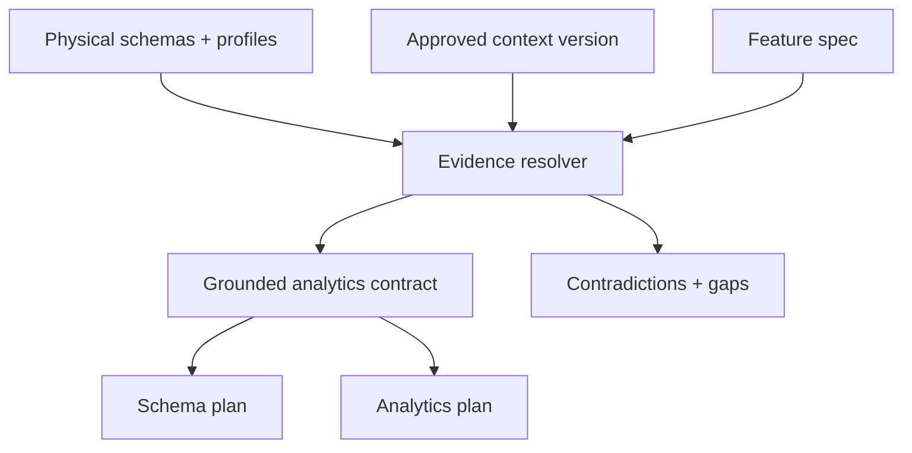
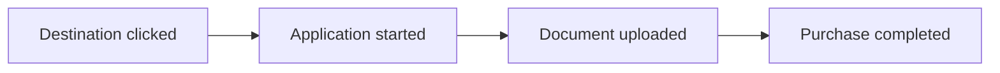
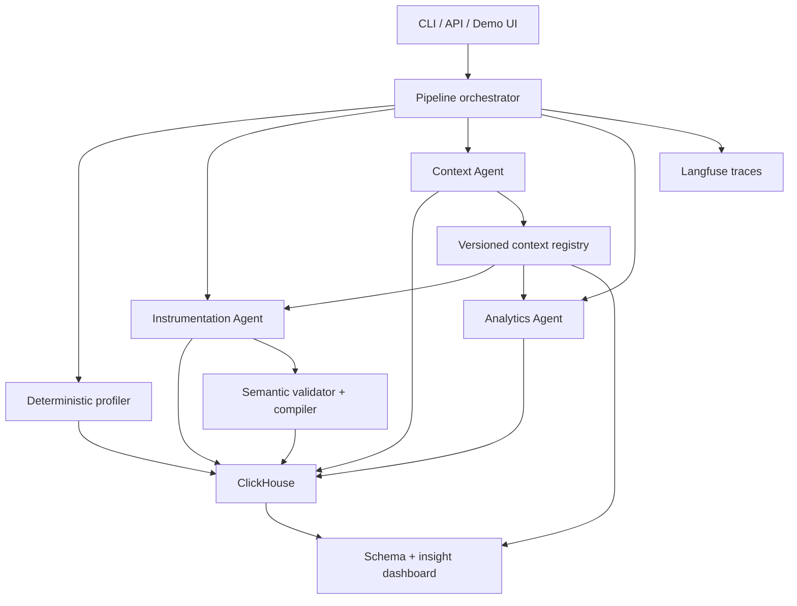

# Atlys Context Compiler — Implementation Plan v2

**Project:** Click-a-thon 2026 · Atlys problem  
**Scope:** Backend-first agentic instrumentation, context management, analytics, tracing, and demo  
**Revision:** v2, aligned with the official Atlys `base_context.md` and the completed Phase 0–2A foundation  
**Primary datastore:** ClickHouse Cloud  
**Current LLM:** local Ollama through an OpenAI-compatible provider interface  

---

## 1. Executive decision

Keep the current Phase 0–2A implementation, but apply one semantic-alignment patch before building schema execution, ingestion, the Context Agent, or the Analytics Agent.

The existing backend is technically healthy:

- FastAPI, configuration, JSON logging, health checks, ClickHouse connectivity, migrations, and optional Langfuse lifecycle work.
- NDJSON profiling is streaming, bounded, deterministic, and privacy-aware.
- Contract generation is provider-neutral, traced safely, validated strictly, and operational with Ollama.
- A real Express Checkout request now produces a structurally valid `AnalyticsContract` in one attempt.

The remaining risk is semantic rather than infrastructural. The model can still emit a contract that passes Pydantic validation while using the wrong entity grain, inventing identifier-shaped entities, creating weak metrics, or ignoring contradictions in the supplied business context. That must be fixed now because every later schema, query, insight, and context update depends on this contract.

The revised order is:

1. Preserve the completed Phase 0–2A foundation.
2. Add a deterministic base-context bootstrap and audit.
3. Ground contract generation in the latest approved context version.
4. Add semantic validation for entity grain, metrics, funnels, assumptions, and supported questions.
5. Then proceed to DDL planning and execution.

---

## 2. Source-of-truth hierarchy

The base context explicitly says it is not gospel. The system therefore needs a stable conflict policy.

Use this precedence order:

1. **Observed physical schema and profiled source data** — authoritative for whether a column/event exists and its observed type or nullability.
2. **Approved context version** — authoritative for business definitions, entity meaning, metric intent, known issues, and approved joins.
3. **Feature specification** — authoritative for intended new behavior, desired questions, and proposed event semantics.
4. **LLM inference** — advisory only; it may propose assumptions or gaps but may not silently override higher-priority evidence.

When sources conflict, do not pick one silently. Record a typed context issue with evidence, severity, status, and affected artifacts.



---

## 3. Canonical business model

### 3.1 Existing event landscape

The eight existing raw tables are one table per event:

| Event/table | Role | Natural analytical grain | Important fields |
|---|---|---|---|
| `destination_card_clicked` | funnel | user/session before application creation | `user_id`, `session_id`, `destination`, `visa_type`, `card_type`, `flow` |
| `application_started` | funnel | application | `application_id`, `user_id`, `destination`, `purpose`, `eta_shown`, `co_travelers` |
| `document_uploaded` | funnel | application/document attempt | `application_id`, `user_id`, `doc_type`, `capture_mode`, `retry_count`, failure-threshold flag |
| `purchase_completed` | conversion | application/payment | `application_id`, `user_id`, `value`, `currency`, `insurance_amount`, `coupon_applied` |
| `search_typed` | supporting | user/session | `search_term`, `results_count`, `source` |
| `landing_page_scrolled` | supporting | user/session/page | `scroll_depth_pct`, `time_on_page_s`, `page_version` |
| `auth_completed` | supporting | user/session/auth attempt | `auth_method`, `is_new_user`, `attempts` |
| `pay_now_clicked` | supporting checkout step | application/payment attempt | `application_id`, `user_id`, `payment_method`, `amount`, `currency`, `coupon_applied` |

### 3.2 Hybrid grain policy

There is no single correct grain for the entire journey.

| Analysis | Required grain/key | Reason |
|---|---|---|
| Leadership purchase conversion | `session_id` | Official headline denominator is sessions. |
| Pre-application browse/search | `session_id` plus `user_id` | `application_id` is not created yet. |
| Application funnel after start | `application_id` | One user may create multiple applications. |
| Cross-session return/re-engagement | `user_id` | User journeys can span sessions. |
| Payment attempt diagnostics | `application_id` plus attempt/event order | One application can have multiple clicks/OTP/payment attempts. |
| New feature workflow | Narrowest stable workflow identifier | Avoid collapsing multiple workflows belonging to one user. |

Rules:

- `application_id` is the default primary grain for flows that start at or after `application_started`.
- `session_id` is the default for leadership conversion and browse behavior.
- `user_id` is a bridge or cohort key, not automatically the primary workflow entity.
- Entity names are semantic types such as `application`, `user`, `session`, or `checkout_attempt`; never observed identifier values such as `user_123`.
- A generic field named `id` must not be treated as a business entity unless the spec explicitly defines its semantics and the evidence confirms it.

### 3.3 Funnel spine

The approved existing funnel is:



Supporting events may explain or refine a step but must not be inserted into the canonical funnel automatically. For example, `pay_now_clicked` is suitable for a checkout sub-funnel and the K1 OTP hypothesis, but search, scroll, and auth are not mandatory stages of every application.

---

## 4. Canonical metric registry

Do not use the ambiguous name `conversion_rate` without a denominator-qualified ID.

| Metric ID | Formula | Grain | Required guardrails |
|---|---|---|---|
| `session_purchase_conversion_rate` | distinct sessions with `purchase_completed` / eligible distinct sessions | session | Define eligible session population and time attribution. |
| `application_purchase_conversion_rate` | distinct applications/users completing purchase after start / distinct applications/users started | application | Preserve event order and window. Prefer application grain where available. |
| `stage_dropoff_rate` | `1 - next_stage_entities / current_stage_entities` | stage-specific | Same entity grain and ordered reach. |
| `stage_step_through_rate` | `next_stage_entities / current_stage_entities` | stage-specific | Same entity grain and ordered reach. |
| `passport_capture_pass_rate` | uploads below failure threshold / uploads | document upload | Confirm boolean encoding and duplicate-attempt policy. |
| `revenue_per_conversion` | sum or average purchase `value` per conversion | purchase/application | Group by `currency` or use an approved FX normalization rule. Never sum mixed currencies. |
| `on_time_delivery_rate` | issued by ETA / issued | fulfilment | Mark unavailable from the eight funnel tables. Never fabricate it. |
| `pay_click_purchase_rate` | ordered purchase completions after pay click / eligible pay clicks or applications | application/payment attempt | State denominator and attribution window explicitly. |

Every metric contract must contain:

- metric ID and human label;
- numerator event/field/filter;
- denominator event/field/filter;
- entity grain and stable key;
- time attribution and analysis window;
- grouping dimensions;
- zero-denominator behavior;
- deduplication policy;
- currency policy where relevant;
- computability status: `computable`, `blocked`, or `external`;
- evidence references and unresolved assumptions.

---

## 5. Context contradictions and gaps to seed

The first approved context version should preserve the official text and add machine-readable issues rather than rewriting history.

| ID | Type | Evidence | Required system behavior |
|---|---|---|---|
| `CTX-001` | schema contradiction | Context says `visa_issuance_eta_days`; observed table uses `eta_shown`, commonly string/nullable. | Flag unresolved mapping/type contradiction; do not enable on-time metrics. |
| `CTX-002` | metric ambiguity | Leadership conversion uses sessions; funnel conversion uses application starters/users. | Split into two named metrics; reject bare `conversion_rate`. |
| `CTX-003` | unavailable data | Issuance timestamp/status are outside the eight tables. | Mark on-time delivery external/uncomputable. |
| `CTX-004` | currency risk | Purchase value is event-currency denominated. | Require currency grouping or approved FX rule. |
| `CTX-005` | grain risk | Pre-application events may have empty `application_id`; users can own multiple applications. | Use hybrid grain; reject a universal user-only funnel. |
| `CTX-006` | physical optimization debt | Legacy tables sort by `(id, timestamp, user_id)` despite time/segment queries. | Record schema recommendation; do not mutate supplied tables automatically. |
| `CTX-007` | missing mapping | Destination region taxonomy is described but no authoritative mapping table is supplied. | Treat region as unresolved until mapped. |
| `CTX-008` | dimension normalization | Device/OS/app-version representations may differ across event sources. | Profile and normalize into canonical dimensions before comparisons. |
| `CTX-009` | time semantics | Event timestamps are ordered but client timezone/late-arrival policy is not fully defined. | Normalize to UTC and expose lateness assumptions. |
| `CTX-010` | duplicate/retry semantics | SDK retries and repeated interaction events can overcount stages. | Define event identity and stage-level deduplication. |

Known issues K1–K7 must be stored as **hypotheses**, not facts proven by current data. The Analytics Agent can use them to prioritize cuts and explain coincidences only when computed evidence supports the relationship.

---

## 6. Revised architecture



### Deterministic/LLM boundary

Deterministic code owns:

- profiling and hashing;
- schema introspection;
- context version selection;
- metric formulas and SQL generation;
- semantic validation;
- identifier/type/order/partition/TTL validation;
- ClickHouse DDL and query execution;
- statistical calculations and evidence numbers;
- artifact persistence and checksums.

The LLM owns:

- interpreting product intent;
- proposing entity and event semantics from the spec;
- identifying questions, assumptions, and context gaps;
- suggesting schema strategy within bounded options;
- narrating validated statistical results for product audiences.

The LLM must never be the source of a displayed number, executable SQL, physical type decision, or final metric formula without deterministic compilation and validation.

---

## 7. Phase status and required alignment work

### Phase 0 — Foundation: completed, small patch required

Keep:

- FastAPI application and dependency injection;
- lazy ClickHouse repository;
- `/health` and `/health/clickhouse`;
- structured UTC JSON logs;
- optional, non-fatal Langfuse lifecycle;
- ordered idempotent migrations;
- UUID metadata IDs and `DateTime64(3, 'UTC')` timestamps.

Add now:

1. Context provenance metadata tables or extend existing equivalents:
   - `context_sources`;
   - `context_entities`;
   - `context_metrics`;
   - `context_relationships`;
   - `context_issues` if not already sufficient;
   - `context_changelog`.
2. A deterministic, idempotent base-context bootstrap command.
3. Content SHA-256, source path/name, source kind, parser version, status, and created time for every context version.
4. `latest approved` context lookup in a repository interface.
5. Configuration must keep the analytical database and metadata database distinct and configurable. Never hardcode `clickathon1`, `atlys`, or `compiler_meta` in business logic.

Do not yet add DDL execution for generated feature schemas.

### Phase 1A — Source profiler and contracts: completed, semantic extensions required

Keep:

- single-pass binary NDJSON processing;
- deterministic hash/size/row-count output;
- bounded cardinality and examples;
- identifier/payload suppression;
- nested dot paths and array item paths;
- timestamp normalization;
- strict contracts and structured 422 behavior;
- upload limits, temporary files, and cleanup.

Add now:

1. Profile hints, derived without retaining values:
   - candidate event-name fields;
   - candidate timestamp fields;
   - candidate stable keys and their coverage;
   - empty/null coverage for `application_id`, `session_id`, and `user_id` when present;
   - duplicate event-ID rate/lower bound where possible;
   - currency field presence and distinct-count lower bound;
   - timestamp monotonicity/late-arrival indicators within bounded sampling rules;
   - canonical dimension candidates for device, OS, geo, destination, app version.
2. Separate semantic entity type from identifier field:
   - entity `application` uses key `application_id`;
   - entity `user` uses key `user_id`;
   - entity names must never be sample values.
3. Add metric computability and evidence references to the contract model if absent.
4. Add explicit workflow grain and attribution-window fields for funnels and metrics.
5. Version contract changes deliberately; either remain backward-compatible in `1.0` or release `1.1` with a documented migration path.

### Phase 2A — Instrumentation intent generation: completed, must be hardened now

Keep:

- provider-neutral async generation;
- Ollama-compatible OpenAI protocol;
- fake provider for deterministic tests;
- safe prompt redaction;
- parsing → validation → deterministic grounding sequence;
- bounded repair attempts and structured blocked results;
- safe timing/tracing metadata;
- pooled HTTP client, cancellation, and total timeout;
- structured-output envelope compatibility layer;
- `ContractIntent` followed by deterministic `AnalyticsContract` compilation.

Add now:

1. **Context grounding**
   - Load the latest approved context version before generation.
   - Include a compact, evidence-referenced context projection in the prompt.
   - Return `context_version_id`, `context_content_sha256`, and evidence IDs in the API artifact.
   - Block generation if no approved base context exists, except in an explicitly named test mode.
2. **Entity semantics**
   - Reject entity names containing observed values or opaque identifiers.
   - Reject entity names that look like UUIDs, hashes, or strings ending in numeric samples.
   - Reject `id` as a stable business key unless explicitly defined by the spec/context.
   - Prefer the narrowest stable workflow key: application or checkout attempt over user when available.
   - Require the primary entity to reference a declared semantic entity type.
3. **Funnel semantics**
   - Enforce chronological step order.
   - Require one consistent entity grain per funnel or an explicit bridge rule.
   - Do not turn supporting events into required funnel steps without evidence.
   - For a post-application checkout feature, prefer `application_id` rather than `user_id`.
4. **Metric semantics**
   - Reject ambiguous `conversion_rate`.
   - Require denominator-qualified metric IDs.
   - Reject duration metrics unless timestamps for both endpoints and a deterministic attribution rule exist.
   - Reject failure-rate metrics without a defined failure event/state/field.
   - Enforce currency grouping or FX normalization.
   - Mark on-time delivery unavailable when fulfilment data is absent.
5. **Assumptions and questions**
   - Never invent numeric targets such as 20% or 30% unless quoted from the spec.
   - Separate blocking assumptions, non-blocking assumptions, supported questions, unsupported questions, and external-data questions.
   - A question is supported when its operands and dimensions are observed or declared by the spec; do not mark it unsupported merely because it needs a query.
6. **Repair quality and latency**
   - Validate the semantic IR before compiling the full contract.
   - Return compact machine-readable repair errors.
   - Do not repeat a repair when the candidate is byte-identical or has the same normalized error signature; block early.
   - Preserve the current request budget and safe logs.

Phase 2A is complete only when the Express Checkout fixture satisfies all semantic acceptance tests in Section 12.

---

## 8. Phase 2B — Schema planner and safe ClickHouse DDL

Start this only after the Phase 0–2A alignment patch passes.

### 8.1 Adaptive table strategy

Do not force one table per feature. The agent must select one of these strategies and provide evidence:

| Strategy | Use when | Avoid when |
|---|---|---|
| Existing-table extension | Existing event semantics and ownership match; change is compatible. | It creates sparse unrelated columns or breaks existing contracts. |
| Shared feature event table | Events share a stable envelope, moderate event variety, and common query paths. | Payloads are highly heterogeneous or a hot event dominates. |
| Dedicated event/workflow table | One workflow is high-volume, latency-sensitive, or has specialized fields. | The feature is tiny and would create table sprawl. |
| Raw landing + typed serving tables | Input evolves rapidly or late/backfill correction is expected. | Complexity has no analytical payoff. |
| Materialized aggregate | Repeated dashboard queries are expensive and stable. | It merely duplicates cheap scans or creates unbounded dimension explosion. |

### 8.2 ClickHouse design rules

- Use `DateTime64(3, 'UTC')` for event time.
- Partition monthly for normal event volume; daily only with evidence of high volume/retention needs.
- Put common time and segment predicates early in `ORDER BY`; never inherit the legacy `id`-first template blindly.
- Use `LowCardinality(String)` only for demonstrably bounded dimensions.
- Use `Nullable` only when absence is meaningful and common enough to justify it.
- Retain raw event time, ingestion time, source event ID, schema/contract version, and trace/run ID.
- Define a duplicate strategy: source event ID or a deterministic fingerprint plus version/ingestion ordering.
- Define late-arrival and backfill behavior before execution.
- TTL must come from an explicit policy; absence of a retention requirement means no guessed TTL.
- Materialized views must have a named consumer/query and a benchmark showing why they earn their keep.

### 8.3 Approval and execution

Pipeline states:

`planned → validated → awaiting_approval → applied → verified`, with `blocked` and `failed` terminal branches.

The unseen spec may run in an event-approved automatic mode, but still produces the exact same plan, validation report, DDL checksum, execution result, and trace.

---

## 9. Phase 3 — Context Agent

Build a living, versioned registry stored primarily in ClickHouse metadata tables.

Responsibilities:

1. Introspect `system.tables` and `system.columns` after a schema change.
2. Compare physical state with the latest approved context.
3. Propose an append-only context version and changelog.
4. Detect contradictions, missing relationships, ambiguous metrics, incompatible types, and stale descriptions.
5. Require approval for breaking semantic changes; allow deterministic auto-approval for additive, high-confidence physical facts.
6. Publish a compact context projection for the Instrumentation and Analytics Agents.

Required properties:

- immutable historical versions;
- approval status;
- content checksum;
- parent version;
- source and evidence references;
- created-by agent/run/trace;
- explicit diffs;
- issue lifecycle: open, acknowledged, resolved, superseded.

---

## 10. Phase 4 — Analytics Agent

The Analytics Agent queries ClickHouse aggregates and receives no raw-row dump.

Analysis loop:

1. Resolve approved metrics and context version.
2. Establish comparison windows with weekday/seasonality awareness.
3. Compute top-level metric movement.
4. Drill into device, OS, geo, destination, app version, acquisition, and relevant feature dimensions.
5. Quantify contribution, confidence, sample size, and multiple-comparison risk.
6. Test known-issue hypotheses K1–K7 as candidate explanations.
7. Generate a product summary only from a structured evidence packet.

Every insight must contain:

- title and product-language summary;
- affected metric and exact change;
- baseline/current windows;
- affected segment;
- contribution or materiality;
- confidence and sample size;
- evidence query ID/checksum;
- context version;
- plausible why, clearly labelled as evidence or hypothesis;
- recommended action and validation query;
- ruled-out cuts.

For K1, a valid conclusion is not “OTP bug caused the drop” from context alone. It is closer to: “The iOS pay-click-to-purchase rate declined in Gulf geos while Android remained stable; this pattern is consistent with K1 and should be verified against OTP failure telemetry.”

---

## 11. Phase 5 — Tracing and demo layer

### Langfuse trace tree

One root trace per pipeline run:

- input validation;
- profiling;
- context resolution;
- intent generation;
- deterministic semantic validation;
- repair, if any;
- contract compilation;
- schema plan and approval;
- DDL execution and verification;
- context update;
- analytical query plan;
- computed evidence;
- narrative generation;
- artifact publication.

Trace metadata should include checksums, counts, model/provider, context version, SQL/query checksums, timings, statuses, and validation codes. Do not log raw events, prompts containing sensitive samples, credentials, or unrestricted model output.

### Minimal dashboard

Show three judge-facing panels:

1. **Schema timeline** — proposed/applied DDL, design rationale, checksum, verification.
2. **Insights** — product summary, confidence, evidence numbers, ruled-out cuts.
3. **Context changelog** — version diff, contradictions, provenance, approval state.

Add a prominent sealed-spec run card containing feature/spec checksum, generated artifacts, timestamps, trace ID, and end-to-end status.

---

## 12. Acceptance gates

### 12.1 Phase 0–2A alignment gate

The patch is accepted only when all of the following pass:

- Official base context can be bootstrapped deterministically and twice without duplicate versions.
- The active approved context is queryable and has a stable content SHA-256.
- CTX-001 through CTX-010 are represented or deterministically discovered.
- `/contracts/generate` returns the context version and checksum used.
- No prompt contains raw NDJSON rows or profiled sample values.
- Express Checkout finishes in one valid attempt on the deterministic fake-provider path.
- The live Ollama path may repair, but repeated identical candidates do not consume all repair attempts.
- Express Checkout primary entity is semantic, with no digits/sample value, and uses `application_id` or a justified narrower checkout-attempt key.
- No entity is named after `payment_method`, an observed value, UUID, hash, or generic sample ID.
- The checkout funnel uses an application/attempt grain, not a universal user-only grain.
- Every metric has explicit numerator, denominator, grain, window, and zero-denominator behavior.
- No invented numeric target or unsupported failure state appears.
- Currency metrics require `currency` grouping or an FX rule.
- On-time delivery is marked unavailable from the supplied sources.
- K1–K7 remain hypotheses until queries support them.
- Existing API behavior remains backward-compatible or the contract version change is documented and tested.
- Ruff, pytest, compileall, migration tests, and `git diff --check` pass.

### 12.2 Phase 2B gate

- Generated DDL parses and passes deterministic ClickHouse policy checks.
- A dry run is default.
- Applied DDL is idempotent and verified in `system.tables`/`system.columns`.
- Ordering, partition, TTL, codecs, and materialized views have query-based rationales.
- Deduplication, late arrival, and backfill policies are explicit.

### 12.3 Analytics gate

- Every displayed number comes from a stored query result/evidence packet.
- Multi-currency revenue is never combined without normalization.
- Funnels enforce order and correct entity grain.
- Insights include sample size, confidence, affected segment, action, and ruled-out cuts.
- Re-running with the same input/context/config produces equivalent deterministic artifacts aside from run IDs/timestamps.

### 12.4 Unseen-spec gate

- One command/API request runs the complete pipeline.
- Spec and input checksums are recorded before model invocation.
- Schema, context diff, insight, and trace are generated by the pipeline.
- No feature-specific code branch or hand-authored sealed-spec artifact exists.
- Failure produces a complete blocked artifact and trace rather than partial silent success.

---

## 13. Recommended immediate sequence

1. Place the official `base_context.md` in a stable repository resource path.
2. Run the Phase 0–2A alignment patch using the prompt below.
3. Run all quality gates and a real Express Checkout smoke test.
4. Inspect the semantic artifact, not only `validation_status`.
5. Freeze the contract/context interfaces.
6. Implement Phase 2B schema planning and dry-run validation.
7. Implement the Context Agent before the Analytics Agent so analysis never starts from a stale snapshot.
8. Add analytics queries/evidence packets.
9. Enable Langfuse and build the minimal judge dashboard.
10. Rehearse a sealed-spec run from a clean process.

---

## 14. What not to change now

- Do not replace the functioning Ollama integration.
- Do not integrate OpenAI yet; retain the provider-neutral toggle for later.
- Do not build DDL execution, ingestion, the Analytics Agent, or frontend in this patch.
- Do not relax Pydantic strictness to make model output pass.
- Do not hardcode Express Checkout-specific event names or fields in production logic.
- Do not let deterministic repair invent semantic content.
- Do not overwrite unrelated user changes or commit/push automatically.

---

## 15. Copy-ready Codex prompt: Phase 0–2A context alignment patch

```text
You are working in the existing `context-compiler` backend for the Click-a-thon 2026 Atlys problem.

Implement only a bounded “Phase 0–2A Context Alignment Patch.” Preserve the current FastAPI, ClickHouse, profiling, provider-neutral Ollama integration, tracing, ContractIntent, deterministic compiler, and strict validation architecture. Do not implement generated feature DDL execution, event ingestion, the full Context Agent, the Analytics Agent, a frontend, OpenAI integration, or feature-specific production branches. Do not commit or push.

Read these files first and treat them as requirements:

1. `ATLYS_IMPLEMENTATION_PLAN_V2.md`
2. the official Atlys `base_context.md` stored in the repository
3. existing contract models, profiler, migrations, instrumentation agent, prompts, validators, repositories, settings, tracing, tests, and README

If the official base-context file is absent, stop and report the expected path instead of inventing its content. Preserve the source text byte-for-byte as provenance; derived structured records are separate.

Goal
----

Make the structurally valid Phase 2A output semantically grounded in the official business context. Fix the current class of failures where a contract can pass structural validation but use sample values as entity names, choose `user_id` for an application-level workflow, create undefined failure/duration metrics, invent numeric assumptions, or ignore context contradictions.

Required implementation
-----------------------

A. Versioned base-context bootstrap

- Add only the metadata migrations needed to store or complete:
  - context sources/provenance;
  - versioned entities;
  - versioned metrics;
  - versioned relationships;
  - typed context issues/contradictions;
  - append-only context changelog.
- Reuse existing context tables when their schema already satisfies the requirement; do not create duplicates under new names.
- Keep one idempotent ClickHouse statement per ordered migration file.
- Add a deterministic CLI/module command that imports the official base context into an approved v1 context.
- Store content SHA-256, parser version, source name/path, parent version where applicable, status, and provenance.
- Running the bootstrap twice with identical bytes must not create a duplicate logical version.
- Keep analytical and metadata database names configurable; do not hardcode `clickathon1`, `atlys`, or `compiler_meta` in business logic.

B. Deterministic context audit

- Compare the approved context claims with the existing ClickHouse physical schemas/profiles where available.
- Seed or discover typed issues equivalent to CTX-001 through CTX-010 in `ATLYS_IMPLEMENTATION_PLAN_V2.md`.
- At minimum capture:
  - `visa_issuance_eta_days` versus observed `eta_shown` contradiction;
  - leadership session conversion versus application-funnel conversion ambiguity;
  - unavailable on-time-delivery data;
  - multi-currency revenue risk;
  - hybrid session/user/application grain;
  - legacy id-first sort-key debt;
  - missing destination-to-region mapping;
  - dimension-normalization gap;
  - timezone/late-arrival gap;
  - duplicate/retry semantics gap.
- Do not silently “correct” the official source text. Store structured findings with evidence and status.
- Store K1–K7 as hypotheses, not proven causes.

C. Context-grounded contract generation

- `/contracts/generate` must resolve the latest approved context before invoking the provider.
- Include a compact, bounded, value-redacted context projection in the prompt.
- Return the context version ID and content SHA-256 used in the response artifact.
- Preserve evidence IDs through ContractIntent and AnalyticsContract where appropriate.
- Block with a structured error if no approved context exists, except through an explicit dependency/test override used by unit tests.
- Never put raw NDJSON rows, profiled example values, complete prompts, unrestricted candidates, credentials, or identifiers into logs or Langfuse.

D. Semantic entity and grain validation

- Separate semantic entity names from key fields. Valid examples: entity `application` with `application_id`, entity `user` with `user_id`, entity `session` with `session_id`.
- Reject entity names that are observed/sample values, UUIDs, hashes, opaque identifiers, or value-shaped names such as `user_123`.
- Reject a generic `id` as a stable business key unless the spec/context explicitly defines its semantics.
- Prefer the narrowest stable workflow key. For a flow occurring after application creation, prefer `application_id` over `user_id`; permit an explicit checkout-attempt key only when observed/declared and stable.
- Require the primary entity to reference a declared semantic entity.
- Require one consistent funnel grain or an explicit validated bridge rule.
- Do not insert supporting events as mandatory canonical funnel stages without evidence.

E. Metric registry and validation

- Introduce denominator-qualified canonical metrics:
  - `session_purchase_conversion_rate`;
  - `application_purchase_conversion_rate`;
  - `stage_dropoff_rate`;
  - `stage_step_through_rate`;
  - `passport_capture_pass_rate`;
  - `revenue_per_conversion`;
  - `on_time_delivery_rate` marked external/unavailable;
  - `pay_click_purchase_rate` where inputs support it.
- Reject bare/ambiguous `conversion_rate`.
- Require every metric to declare numerator, denominator, entity grain/key, window/time attribution, deduplication, zero-denominator behavior, dimensions, computability, and evidence.
- Reject duration metrics without both timestamp endpoints and a deterministic attribution rule.
- Reject failure-rate metrics without an observed/declared failure event, state, or field.
- Enforce grouping by currency or an approved FX-normalization rule for money metrics.
- Never infer on-time delivery from pre-purchase tables.

F. Assumptions, questions, and repair behavior

- Never invent numerical targets or expected lifts unless the exact number is in the spec/context evidence.
- Keep blocking assumptions, non-blocking assumptions, supported questions, unsupported questions, and external-data questions distinct.
- A question is supported if its operands and dimensions are observed or explicitly declared; needing a ClickHouse query does not make it unsupported.
- Validate the compact intent before compiling the full contract.
- Send only safe, compact validation errors to repair.
- If a repair candidate is byte-identical or has the same normalized semantic-error signature as the previous candidate, stop early with a structured blocked result instead of spending another slow Ollama call.
- Preserve the current timeout, cancellation, pooled client, error sanitization, and safe timing logs.

G. Profiler extensions

- Extend deterministic profile metadata only where required to support semantic validation:
  - candidate stable keys and non-null/non-empty coverage;
  - `application_id`, `session_id`, and `user_id` coverage when present;
  - duplicate event-ID indicator/lower bound where feasible;
  - currency-field presence and bounded distinct-count metadata;
  - canonical dimension candidates for device, OS, geo, destination, and app version;
  - safe late-arrival/time-quality indicators where deterministically computable.
- Keep one-pass/bounded-memory behavior and never retain/log identifier values or raw payloads.

Compatibility
-------------

- Preserve existing public endpoints and successful response fields unless a deliberate version bump is required.
- If contract schema changes are not backward-compatible, introduce a documented `1.1` version and migration behavior; do not silently redefine `1.0`.
- Keep Ollama as the active provider. Do not add OpenAI-specific code; the existing provider-neutral interface is the future toggle.
- Keep Langfuse optional and non-fatal.

Tests and acceptance
--------------------

Add deterministic tests for every new rule and regression tests for existing behavior. Include at least:

1. bootstrap idempotency and stable content hash;
2. latest-approved context selection;
3. all ten base-context contradiction/gap classes;
4. context version/checksum in contract API output;
5. no raw rows/example values in provider messages or traces;
6. rejection of `user_123`, UUID/hash/value-shaped entity names, and unjustified generic `id`;
7. application-level feature chooses `application`/`application_id` rather than `user_id` when supported;
8. consistent funnel grain and ordered steps;
9. rejection of ambiguous conversion, undefined duration, undefined failure, mixed-currency, and unavailable on-time metrics;
10. rejection of invented numeric assumptions;
11. correct supported-versus-external question classification;
12. early stop on repeated identical repair output/error signature;
13. fake-provider Express Checkout produces a valid grounded contract in one request;
14. existing profiler/API/provider/envelope/health tests remain green.

For the Express Checkout semantic assertion, require:

- semantic feature name;
- primary entity contains no sample value/digits and is `application` or a justified narrower attempt entity;
- stable key is `application_id` or a justified observed attempt key;
- checkout funnel uses the same application/attempt grain;
- metrics contain explicit operands and no fabricated failure state/duration/target;
- OTP/platform diagnostic question is supported when the profile/spec supplies the necessary events and dimensions;
- K1 is only a hypothesis/evidence reference.

Verification commands
---------------------

Run and report:

`uv lock` only if dependencies changed
`uv sync --locked`
`uv run ruff format .`
`uv run ruff format --check .`
`uv run ruff check .`
`uv run pytest -q`
`uv run python -m compileall -q app tests`
`git diff --check`

If ClickHouse credentials are configured, also run migrations, bootstrap context twice, verify the active approved context and issues, then run one live Express Checkout smoke request. Do not expose credentials or raw input. Report the semantic artifact summary, attempts, context version/hash, elapsed time, and safe stage timings.

Before editing, inspect the dirty worktree and preserve unrelated changes. Use `apply_patch` for manual edits. Do not commit or push. End with files changed, design decisions, test results, live checks performed/not performed, and any remaining blocker.
```

---

## 16. Mentor-facing positioning

The strongest innovation claim is not “three agents use an LLM.” It is:

> A versioned semantic compiler turns an untrusted product spec and raw events into a grounded analytics contract, production-aware ClickHouse design, and evidence-backed product insight. Physical schemas outrank stale prose, contradictions become first-class data, and every downstream decision is tied to the exact context version and trace that produced it.

This is feasible because ClickHouse performs profiling, aggregation, funnel computation, and evidence queries; deterministic code compiles and validates; the LLM interprets intent and narrates results. The demo is credible because a judge can follow one sealed spec from checksum to schema, context diff, insight, and trace.
